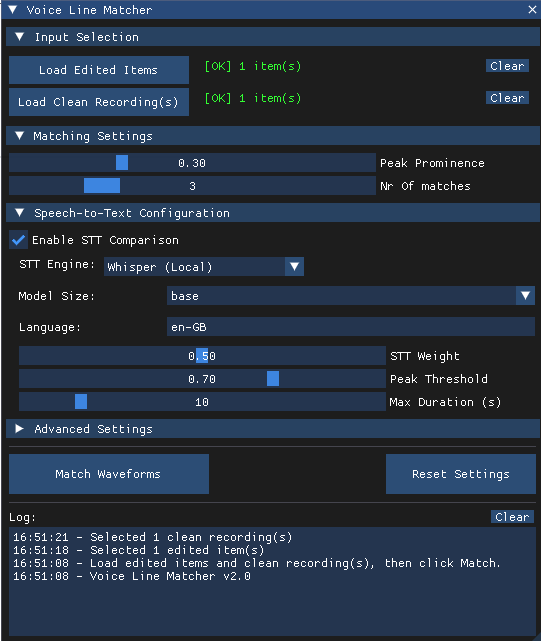

# Waveform Matcher
---

The **Waveform matcher** is a tool for reaper to match similar voice recordings from a different media item based on peak detection and experimental Speech-to-text(STT)

**Why?**
When doing remote recordings we record we record remotely  and already do edits on it but this recording often has problems like artifacts. so we have to manually find  the part from the clean recording and match it to the edited files. 

**how?**
For peak detection, we detect peaks in both the clean and the edited items, and then compare the edited peak pattern with the pattern following each peak in the clean file. In addition to comparing the absolute positions of the peaks, we also analyze the relative distances between peaks. This ensures the system still works when there are timing differences, for example due to network latency.
The peak-to-peak comparison is already very accurate: in about 95% of cases it identifies the correct files, though it sometimes struggles with very short items. For files with a high amount of artifacts, we additionally can apply a experimental feature STT, which should further increases accuracy but will also significantly increases processing time (about …% in our testing).

**Tips:**
- If a file is not managing to find a match try increasing its length as the peak-to-peak maching can have trouble with short filles
- Instead of doing STT on all your items do a pass first with only peak matching and then if there are items that didn't get the correct matches try STT

## How to use the Waveform Matcher
---

1. import your clean and edited files into reaper on separate tracks
2. Select the edited item(s) in reaper and then click **Load Edited Item(s)** button in the Waveform Matcher GUI. 
3. Select the clean item(s) in reaper and then click **Load Clean Item(s)** button in the Waveform Matcher GUI.
4. Configure peak detection setting
5. Optional: Configure STT settings, select the STT engine that you want to use and fill its required arguments. STT should increase accuracy but it is also quit accurate without, and it will slow down the process significantly.
6. Click Match Waveforms -> now it will search the clean file for matches to the edited files and copy the best matches below each edited file. You can look at the log at the bottom to see details and potential errors.
7. When the progress bar has finished check the matches to make sure they are correct.

## Installation:
---
Reapack
1. Download and install Reapack for your platform here(also the user Guide): Reapack Download
2. go to Extensions->Reapack->Import Repositories paste the following link: Comming soon

Manual:
1. Download or clone the repository.
2. Add compareWaveform.lua as a new action in reaper, if you move it make sure stt_transcribe.py is in the same folder for STT to work.

## STT Setup (Optional) : 
---
**STT Engines Available:**
- **Google (Free)** - No setup, ~50 requests/day limit
- **Google Cloud** - Requires credentials, excellent accuracy, paid
- **Azure** - Requires API key, excellent accuracy, paid(free version)
- **Whisper (Local)** - Offline, excellent accuracy, slower
- **Vosk (Local)** - Offline, fast, good accuracy

**Google (Free)** - Recommended for getting started
1. Install Python 3.8+ with pip
2. Run: `pip install SpeechRecognition`
3. In the UI, check "Enable STT Comparison"
4. Select "Google (Free)" from the engine dropdown
5. Done! (~50 requests/day limit)

**Google Cloud** - Excellent accuracy, paid
1. Install Python 3.8+ and run: `pip install SpeechRecognition`
2. Create account at [console.cloud.google.com](https://console.cloud.google.com)
3. Enable "Cloud Speech-to-Text API" for your project
4. Create service account with "Cloud Speech Client" role
5. Download JSON credentials file
6. In the UI, select "Google Cloud" engine
7. Enter full path to your JSON credentials file

**Azure** - Excellent accuracy, paid
1. Install Python 3.8+ and run: `pip install SpeechRecognition`
2. Create account at [portal.azure.com](https://portal.azure.com)
3. Create a "Speech Services" resource
4. Copy your API key and region from resource page
5. In the UI, select "Azure" engine
6. Enter your API key and region (e.g., "westeurope")
  
**Whisper (Local)** - Offline, excellent accuracy
1. Install Python 3.8+ with pip
2. Run: `pip install SpeechRecognition openai-whisper`
3. In the UI, select "Whisper (Local)" engine
4. Choose model size (base recommended, large for best quality)
5. First use will download the model (may take several minutes)

**Vosk (Local)** - Offline, fast
1. Install Python 3.8+ and run: `pip install SpeechRecognition vosk`
2. Download model from [alphacephei.com/vosk/models](https://alphacephei.com/vosk/models
3. Extract ZIP to a folder (e.g., `C:\vosk-model-en-us-0.22`)
4. In the UI, select "Vosk (Local)" engine
5. Enter full path to extracted model folder
